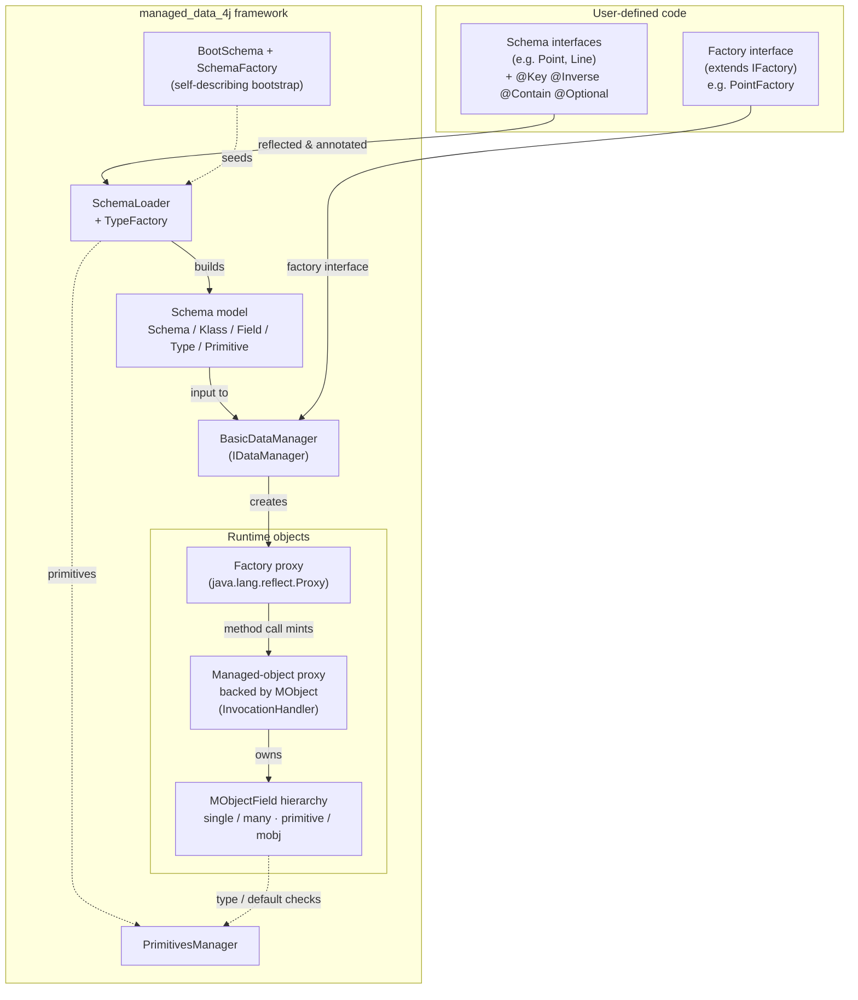
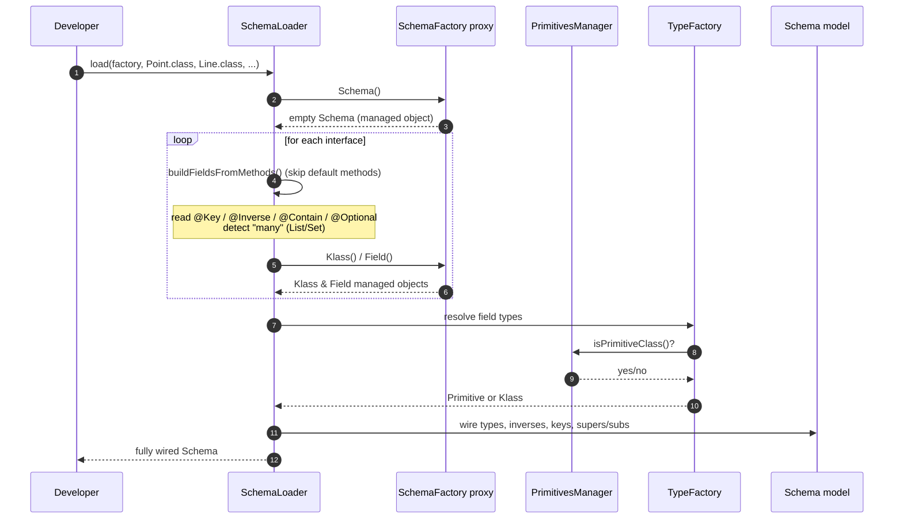
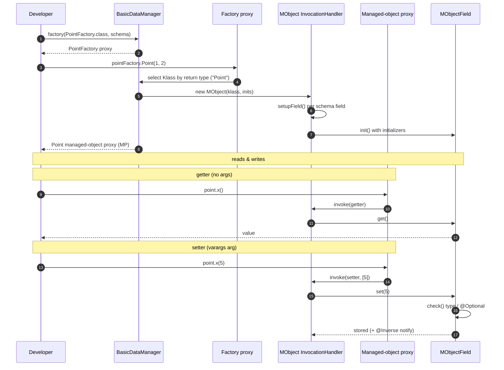
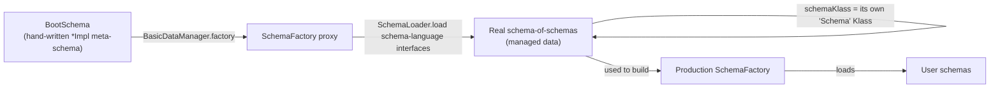

# Managed Data for Java

[](https://travis-ci.org/TheolZacharopoulos/MD4J)

[](https://bettercodehub.com/)

MD4J is a Managed Data implementation in Java.

## Influence
In their study on [managed data](http://www.cs.utexas.edu/~wcook/Drafts/2012/ensodata.pdf), 
Cook et al. presented the main idea of managed data, 
while using a show case of it in a Ruby implementation. 
As a use case, they presented the [Enso](https://github.com/enso-lang/enso) project, which is a Ruby implementation of managed data.

JavaMD is an extension of their work; we implement managed data in Java using the Java reflection API and dynamic proxies. 
Although proxies in static programming languages can not implement the full range of managed data, 
Java provides a strong implementation of the MOP, which can be used though the Java Reflection API. 

## Installation
The project is built with maven.

### Run tests
`mvn test`

### Build the (jar) library
`mvn clean package`

## Overview

It is important to mention that our implementation is inspired by Enso, which is written in Ruby. 
Although Ruby is a dynamic language, Enso significantly contributed to our implementation's design.

Managed data allows the programmer to handle the fundamental data manipulation mechanisms using **Data Managers**, 
one of its distinguishing features being modularity.
Using a data description language the programmer defines **Schemas**.
**Schemas** are the input of **Data Managers**. 
A **Data Manager** in turn interprets the data description language that is used to define 
the structure and the behavior of the data to be managed.
**Schemas** and **Data Managers** are essential components of managed data, 
along with **Integration** in the programming language, in this case being Java.

### Schemas
To create instances of data, we first need to define their structure.
**Schemas** describe the outline structure of our data.
In order to define **Schemas** in managed data we need a data description language 
that allows to define records as collections of fields.

For our implementation we chose to use *Java Interfaces* as a data description language to define records of managed data.
By using Java interfaces we use Java's syntax for our definitions.
Moreover, Java interfaces use several conventions to encode semantics, 
for instance Java annotations, which are very useful for meta data definition on **Schemas**.

Additionally, there are several attributes, considered meta data, that help define the structure of a **Schema**.
In order to define the meta data in our data description language (interfaces), we use **Java Annotations**.
Annotations are very declarative in the way they express meta data in interfaces and they are consistent with the system (Java).

Thus, to provide a field with meta data, we define annotations in a **Method** target level 
since a **Field** is defined by a **Method** declaration Java interfaces.

The list of the available structure concepts that are supported in our language is presented below:

* **@Key** When a method (field definition) is annotated with the `@Key` annotation that forces its value 
    to be unique within collections of this field's Klass.
	The key should be used on a single field of a Type and its value represents the uniqueness of its Klass's instance.
	Another way to look at this is as a counterpart of the *hashCode* in traditional Java programs.
	This way when many values of a Klass are in a Set, the key field ensures uniqueness in its context.

* **@Inverse** This annotation includes two [annotation element definitions](https://docs.oracle.com/javase/tutorial/java/annotations/declaring.html).
	When a method is annotated with the `@Inverse(Class other, String field)` annotation, 
	then the inverse `field` element must be a `Field`'s name in the `Class` interface, given by the `type` element.
	This meta data is used as a reference declaration in schemas, meaning that when a 
	programmer updates the value of a field that is annotated with inverse, then the value of the field that refers to will be also updated.
	This mechanism is interpreted by the managed object and is used for automated *wiring* of the field across a schema.

* **@Contain** When a field is annotated with the `@Contain` annotation, then this field is considered as *traversal*. 
	In general, traversals describe a minimum spanning tree that is called *spine* and ensures reachability of values.
	The spine is used in implementations that need a depth-first search by distinguishing between the actual information and 
	the cross-references of the spanning tree.
	If a spanning tree is defined, then all nodes in a model must be uniquely reachable by 
	following just the spine fields.
	Sometimes traversal fields describe composition, or *"is a part of"*, relationships.

* **@Optional** When the `@Optional` annotation is on a field's definition this field can include `null` values.
	`Inverse` fields are `Optional`. 

* **Java Inheritance** In addition to the Java annotations, our language uses more Java mechanisms for schemas definition. 
	Java inheritance is one of them.
	 
	A **schemaKlass** can extend another Klass (super), which works as the traditional Java inheritance, supporting sub typing mechanisms.
	Implementing this we introduce a *Type Hierarchy* model that includes super and sub classes on managed objects.
	Note that since we use interfaces for **schemaKlass**, 
	we implicitly support multiple inheritance because a Java interface can extend more than one interfaces.

* **Java Collections** Finally, another Java mechanism that we use is the definition of a field that includes many values.
	To define such a field, a programmer has to declare a field's Type as a `java.util.List` or a `java.util.Set` of this **Type**.

### Schema Factories

However, even if we have the definitions of schemas, we still need a way to create instances of managed data described by them.
We can not use Java's mechanisms (`new` keyword) for this functionality since we need them to be managed data and not ordinary objects.
Thus, we use Java interfaces to define *Schema Factories*.
A *Schema Factory* is a list of constructor definitions for specific schema Klasses.

The methods in this interface are used similarly to the constructors in a Java class, 
while their implementation is handled by the data managers.

### Data Managers

However, the schemas are not a complete managed data specification without a corresponding **Data Manager**.
A data manager is responsible for interpreting the schema and building virtual objects (managed objects). 
The managed object's fields are defined by the given schema and acts according to the specifications given by the data manager.
Additionally, the data manager ensures that the data given are valid with respect to the schema.
More specifically, the data managers describe how a schema definition is handled from the outside world and what its specifications are.
These properties may include CCC that can be described separately by special data managers, separating schema and concern definitions.
Thus, a managed object can have multiple interpretations based on the data manager that is used to interpret it.

A data manager is initialized with a **Schema** and provides a new **Managed Object** 
instance whose properties are defined by that data manager.
Additional to the **Schema** that includes a Set of **Types** (*Primitives* or *Klasses*), 
it also needs a **Schema Factory** that declares the constructors of the given schema **Klass**.
After the initialization of a data manager and the interpretation of the schemas, 
a data manager provides the mechanism of building new **Schema Factories**, 
which in turn create **Managed Objects** with the specifications of the data manager.

#### Implementing a Data Manager
The implementation and the integration of a new data manager is straight forward in this framework.
The basic components of a new data manager implementation are 
* the `DataManager` class (proxy) and 
* the `MObject` class (invocation handler).

First, to follow the modularity aspect and the ability to stack data managers together combining their specifications, 
we need to inherit from, at least, the `BasicDataManager` and its `MObject` respectively.
A simple data manager that could be useful is a data manager that introduces immutability to its managed objects.
A `Lockable` data manager should first inherit the `BasicDataManager` to get its field access specification.
The implementation of the `LockableDataManager` is illustrated bellow:

```
public class LockableDataManager extends BasicDataManager {

	public LockableDataManager(Class<?> moSchemaFactoryClass, Schema schema) {
		// Add the Lockable class in order to use it in the managed object.
		super(moSchemaFactoryClass, schema, Lockable.class);
	}

	@Override
	protected MObject createManagedObject(Klass klass, Object... _inits) {
		return new LockableMObject(klass, _inits);
	}
}
```

Additionally, it should add some *locking* mechanism to ensure immutability of its objects.
This is defined in the `Lockable` interface, which is responsible of ensuring the implementation of the specifications. 
Bellow the `Lockable Interface` the specifications of the interface is showed:

```
public interface Lockable {
	void lock();
}
```

Since we have the specifications and the data manager that creates the `Lockable` managed object, we still need the implementation.
The implementation is located in the `MObject` and in this case the `LockableMObject`.

```
public class LockableMObject extends MObject implements Lockable {
	private boolean isLocked = false;

	public LockableMObject(Klass schemaKlass, Object... initializers) {
		super(schemaKlass, initializers);
	}

	public void lock() {
		isLocked = true;
	}

	@Override
	public void _set(String name, Object value) 
	throws NoSuchFieldError, InvalidFieldValueException, NoKeyFieldException {
		if (isLocked) {
	    	throw new IllegalAccessError(
	    		"Cannot change " + name + " of locked object " + schemaKlass.name() + ".");
		}
		super._set(name, value);
	}
}
```

The `LockableMObject`, by extending the `MObject` and implementing the `Lockable` interface, 
inherits the basic functionality of a managed object and gets a specification description respectively.

Its role is to implement the logic of the immutability, which is as simple as it looks.
In order to use this functionality, one needs to create managed objects using this data manager.
An example of how this can be used is shown bellow:

```
final PointFactory lockablePointFactory = lockableFactory.make();
final Point2D lockablePoint = lockablePointFactory.Point2D(1, 2);

// It was mutable until now, now it is locked (immutable).
((Lockable)lockablePoint).lock();

try {
	lockablePoint.x(2); // Should throw here since its immutable.
} catch (IllegalAccessError e) {
	System.out.println("IllegalAccessError: " + e.getMessage());
}
...
```

## Architecture

This section gives a high-level view of how MD4J turns plain **Java interfaces** into
**managed objects** at runtime, using the Java Reflection API and `java.lang.reflect.Proxy`.

> The diagrams below use [Mermaid](https://mermaid.js.org/), which GitHub renders automatically.

### Core building blocks

MD4J is built around four cooperating layers that live in `nl.cwi.managed_data_4j`:

| Layer | Key types | Responsibility |
| --- | --- | --- |
| **Schema model** | `Schema`, `Klass`, `Field`, `Type`, `Primitive` (in `language/schema/models`) | A meta-model that describes the *structure* of data: which klasses exist, their fields, types, keys and inverses. |
| **Schema loader / bootstrap** | `SchemaLoader`, `TypeFactory`, `BootSchema`, `SchemaFactory`, `SchemaFactoryProvider` | Reads a user's Java interfaces (plus `@Key`/`@Inverse`/`@Contain`/`@Optional` annotations) and *interprets* them into a `Schema` instance. The schema language is **self-describing**: the model that describes schemas is itself bootstrapped from a hand-written meta-schema. |
| **Data manager** | `IDataManager`, `BasicDataManager` | Takes a `Schema` + a factory interface and produces a dynamic **proxy factory**. Each factory call mints a new managed object (another proxy). Data managers are *stackable* to add cross-cutting concerns. |
| **Managed object** | `MObject` (an `InvocationHandler`) and the `MObjectField` hierarchy | Backs each managed-object proxy. It intercepts every method call and routes it to field reads/writes, enforcing types, defaults, `@Key` uniqueness, `@Inverse` bidirectional wiring and `@Contain` containment. |

### Component overview



### How a schema is loaded (interpretation)

`SchemaLoader.load(...)` walks the user's interfaces via reflection, turns each method into a
`Field`, resolves annotations, and wires the resulting graph of schema objects together.



### How a managed object is created and used (runtime)

A `BasicDataManager` wraps the schema behind **two** layers of dynamic proxies: a *factory* proxy,
and the *managed object* proxy it produces. Every call on a managed object is intercepted by its
`MObject` invocation handler and dispatched as a field get or set.



### Annotation semantics at a glance

| Annotation | Where it is read | Runtime effect |
| --- | --- | --- |
| `@Key` | `SchemaLoader.buildFieldsFromMethods` | Marks a klass's unique key field. Drives `List` vs keyed `Set` storage for `many` reference fields (`MObjectFieldManySet`). |
| `@Inverse(other, field)` | resolved during loading, enforced in `MObjectField.notify` | Maintains **bidirectional references** automatically: setting one side updates the other via `Proxy.getInvocationHandler(...)`. |
| `@Contain` | `SchemaLoader` → `field.contain(true)` | Marks a *containment* (ownership / "is part of") field, defining the spine of the model. |
| `@Optional` | `MObjectFieldSingleMObj.check` | Relaxes the non-null constraint so the field may hold `null`. |

### The self-describing bootstrap

The schema language is itself expressed as managed data. `SchemaFactoryProvider` seeds the system
from a hand-written meta-schema (`BootSchema`, built with the `*Impl` classes), proxies a
`SchemaFactory` over it, and then re-loads the schema-language interfaces *through that factory* so
that `Schema`, `Klass`, `Field`, etc. become managed objects described by their own `Klass`.



## Examples

A list of examples is given [here](https://github.com/TheolZacharopoulos/MD4J/tree/master/src/main/java/nl/cwi/examples).
